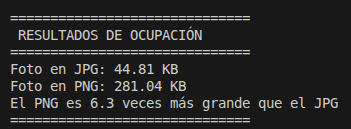
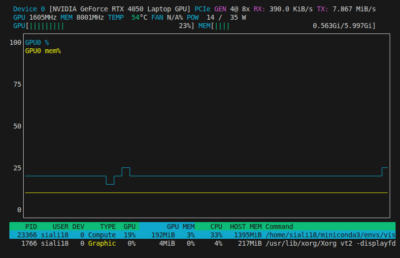

# Proyecto Visión Artificial: De la Captura a la Inferencia (YOLOv8)

Este proyecto documenta la evolución desde el control básico de dispositivos de captura hasta la implementación de modelos de Deep Learning en tiempo real.

---

## 💻 Especificaciones del Sistema
* **Hardware:** Portátil MSI Thin GF63 (GPU RTX 4050 6GB | CPU i7 12th Gen | 32GB RAM).
* **Entorno:** Linux / Python 3.10.

---

## 🔵 FASE 1: Captura y Procesamiento de Vídeo (OpenCV)
En esta etapa inicial nos centramos en la comunicación con el hardware y la manipulación de frames básicos.

### Hitos conseguidos:
1. **Acceso a Cámara:** Conexión estable con la webcam integrada.
2. **Modo LIVE:** Streaming de vídeo con cierre mediante tecla 'q'.
3. **Procesado Geométrico:** Dibujo de un círculo central de referencia y reescalado dinámico de la ventana.
4. **Métricas de Rendimiento:** Implementación manual del cálculo de **FPS** y tiempo de refresco en milisegundos (ms) para medir la fluidez del stream.

---

## 🟢 FASE 2: Integración de IA y Monitorización (YOLOv8)
En esta fase añadimos la capa de inteligencia artificial para la detección de objetos.

### 2.1 Captura y Formatos de Imagen
Evaluación de la inferencia sobre frames estáticos y comparativa de almacenamiento:
* **Formatos:** Análisis de peso y calidad entre `.jpg` y `.png`.

  

### 2.2 Inferencia en Tiempo Real
Evolución del script de la Fase 1 integrando el modelo `yolov8s.pt`.
* **Optimización:** Uso de `verbose=False` para evitar la saturación de la terminal.
* **Resultados:** Detección múltiple de objetos manteniendo una tasa de refresco fluida gracias a la aceleración por hardware.

### 2.3 Análisis de Recursos

Durante la ejecución de la inferencia en tiempo real con el modelo YOLOv8s, se han monitorizado los recursos del sistema mediante `nvtop`:

* **¿Usa CPU o GPU?**
    El sistema utiliza principalmente la **GPU (NVIDIA RTX 4050)**. En la monitorización se observa que el proceso de Python aparece bajo el tipo de tarea "Compute" en la tarjeta gráfica, con una carga del **19%**. La CPU mantiene un uso del **33%**, pero se limita a tareas de gestión del sistema y flujo de vídeo, no al cálculo de la IA.

* **¿Aumenta la memoria del ordenador (RAM) o la de la gráfica (VRAM)?**
    El aumento principal se produce en la **VRAM (Memoria de la gráfica)**. 
    * **VRAM:** El modelo se carga directamente en la memoria de la tarjeta de vídeo, ocupando **192 MiB**. 
    * **RAM:** El uso de la memoria del ordenador se mantiene estable en **1.4 GB**, ya que una vez cargadas las librerías iniciales, el peso del procesamiento de imágenes recae en la memoria dedicada de la GPU.

  
   
  <i>Evidencia: La GPU asume la carga pesada de la IA, permitiendo que la CPU no se sature.</i>

---

## 🛠️ Instalación y Uso
1. Instalar dependencias: `pip install -r requirements.txt`
2. Ejecutar Fase 1 (Básico): `python src/video_basico.py` (o tu nombre de archivo)
3. Ejecutar Fase 2 (YOLO): `python src/yolo.py`